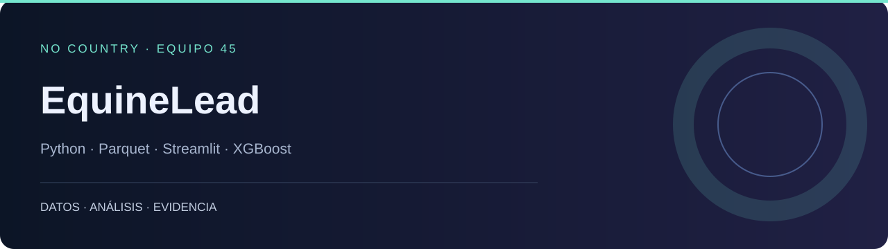

# EquineLead

**Analítica del mercado ecuestre para explorar audiencia, inventario y oportunidades comerciales.**

NO COUNTRY · EQUIPO 45 · Python · Parquet · Streamlit · XGBoost

[No Country Showcase](https://nocountry.tech/showcase/simulacion-laboral-febrero-2026/equipo-45-data-science) · [Portafolio](https://dodysalim.github.io/) · [Caso y alcance](docs/PORTFOLIO_CASE.md) · [Verificación](docs/VALIDATION.md)

## La pregunta

¿Cómo se relacionan visitas, interacción e inventario con las oportunidades de conversión?

## Qué puedes revisar

- Seis vistas de inventario, retail, audiencia, conversión y subsistema de IA.
- Carga de Parquet con selección de columnas y límites para sesiones.
- Pipeline y servicios de ML del equipo; versionado de datos con DVC.

## Inicio local

Usa Python 3.11 o 3.12 en un entorno independiente. Desde la raíz:

```bash
python -m venv .venv
# Windows: .venv\Scripts\activate
# macOS/Linux: source .venv/bin/activate
python -m pip install -r app/requirements.txt
```

Después de configurar los datos:

```bash
python -m streamlit run app/app.py
```

## Datos y configuración

Necesita los cinco Parquet originales en data/clean o app/data/clean, o acceso DVC/GCP (EQUINE_DATA_DIR permite otra ruta). Sin ellos muestra instrucciones; no sustituye los datos por un conjunto ficticio.

## Power BI · PC y móvil

[Archivos e instrucciones](powerbi/README.md). Descarga el repositorio completo y abre `powerbi/Abrir-PowerBI.bat` en Windows; después pulsa **Actualizar**. Incluye A4 horizontal a tamaño real (100 %) y diseño móvil vertical. El archivo `.pbip` necesita sus carpetas Report, SemanticModel y data.

## Recorrido por el código

| Ruta | Qué contiene |
| --- | --- |
| [app/](app/) | Dashboard y módulos analíticos |
| [src/](src/) | Pipelines, modelos y API |
| [docs/](docs/) | Arquitectura y metodología |
| [assets/](assets/) | Identidad visual del equipo |

## Comprobación y alcance

Arranque sin credenciales comprobado: presenta las instrucciones de configuración, sin excepción. Tres pruebas de rutas y lectura Parquet aprobadas: reconoce la salida DVC, prioriza una carpeta completa y respeta una ruta explícita.

No se reentrenaron los modelos ni se validó la API remota, GCP, DagsHub o la descarga DVC. Las sesiones se limitan a 10.000 filas por tabla en la vista inicial.

## Autoría

No Country S02-26-E45. Rol documentado de Dody Dueñas: Data Analyst; arquitectura y modelos son trabajo colectivo.

| Nombre | Rol |
| --- | --- |
| **Alexander Rios** | Data Scientist & ML Engineer |
| **Daisy Quinteros** | Data Engineer & Data Scientist |
| **Iñaki Rosello** | Data Scientist & ML Engineer |
| **Dody Dueñas** | Data Analyst |


[Documentación anterior](docs/ORIGINAL_README.md), conservada como referencia histórica.

## Despliegue del equipo

La cadena Docker/GCP del equipo se activa con la variable de repositorio `DEPLOY_ENABLED=true` y sus credenciales. Sin esa configuración, el fork no intenta desplegar en servicios del equipo.
